 
 

 
<h1 align="center">👋 Hey there! I'm Anmol</h1>

A full-stack (react & nextjs) developer, discord bot dev and motion graphic designer who lives in India.

CSE Undergrad @ NSUT

    
    
    

    

<h2>😃 Socials</h2>
<h3>Check out my socials:</h3>
<li>
<a href="https://discord.gg/c2ZTMHJ64E">Discord</a>
</li>
<li>
<a href="https://twitter.com/AnmolPlayzz">Twitter</a>
</li>
<li>
<a href="https://reddit.com/u/AnmolPlayz">Reddit</a>
</li>
 
 
<h2>🔨 Tools I use</h2>

| Tool      | Use |
| ----------- | ----------- |
| JetBrains WebStorm      | JavaScript, HTML, CSS, React, Next       |
| JetBrains PyCharm Community | Python |
| Adobe Illustrator   | Icons & Illustrations        |
| Adobe After Effects   | Animation        |

 
 
<h2>🎀 My stats</h2>

 
 
<h2>✨ Most used languages</h2>

 
 

---

 

Thanks for reading my stupid README, I appriciate your co-operation.

